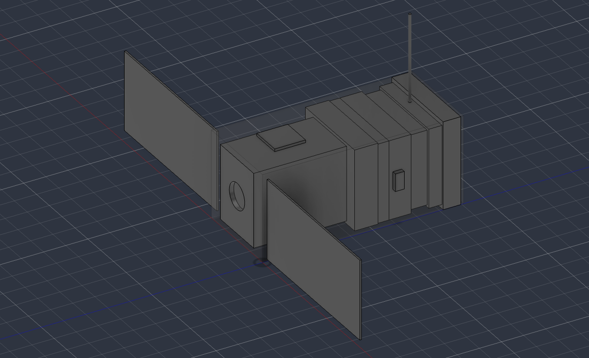

# AURORA-1

AURORA-1 is an independent preliminary design study for a **2U Earth-observation CubeSat** operating in a nominal **500 km circular low-Earth orbit**.

The project integrates mission design, requirements development, subsystem trades, orbit analysis, power budgeting, communications analysis, ADCS modeling, thermal analysis, mass properties, and Autodesk Fusion CAD packaging.

## Key Results

- Orbital period: **94.61 min**
- Eclipse duration: **35.75 min**
- Average spacecraft power: **~3.59 W**
- Solar generation target: **~7.50 W**
- Minimum payload downlink requirement: **100 kbps**
- Imaging pointing requirement: **±2°**
- Simulated final pointing error: **0.382°**
- 2U architecture selected through a 1U vs. 2U trade study

## Tools

MATLAB • Autodesk Fusion • Microsoft Excel • Systems Engineering • Trade Studies • Power Budgeting • Link Budgeting • Thermal Modeling • ADCS Analysis • CAD Packaging

## Documentation

- Preliminary Design Report
- One-Page Portfolio Summary
- Design Review Presentation

## Status

Preliminary digital design baseline complete. Future work includes orbital lifetime analysis, higher-fidelity thermal modeling, EPS refinement, and three-axis ADCS analysis.
